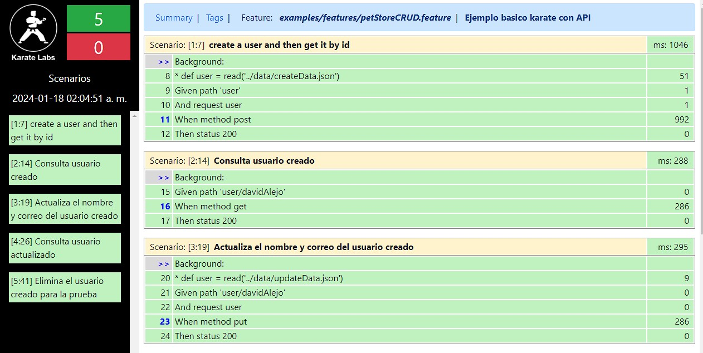

# KarateBasicExercise
Ejercicio basico de Pruebas de API con Karate

# Estructura Basica del Proyecto

	+ main
		+ src
			+ test
				+ java
					+ examples
						+ users
							user.feature
						ExamplesTest.java
						

# Requisitos Previos

	- JDK v17.0.9
	- Maven v17.0.9
	- IntellIj (Ultima versión recomendado)

# Ejecución Archivo

Se puede correr el set de pruebas y obtener el informe ejecutamos con el comando
	- mvn clean test
	
O si solo queremos probar los Test, podemos correr la clase ExamplesTest ubicado en
	- /src/test/java/examples/users/UsersRunner.java
	
# Ruta informe
El informe se crea en la ruta:
	- main/target/karate-reports/examples.users.users.html
	

	

	

